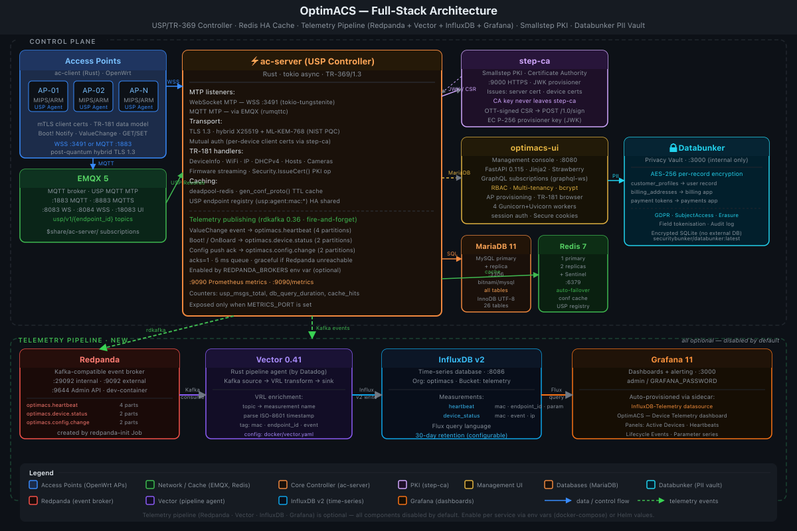

# ac-client — USP Agent for OpenWrt Access Points

`ac-client` is a Rust daemon implementing the **TR-369 / USP 1.3 Agent** (User Services Platform, Broadband Forum) for OpenWrt-based access-point devices managed by an [OptimACS](https://github.com/optim-enterprises-bv/APConfig) controller (`ac-server`).

---

## Why ac-client? Why OptimACS?

### The problem with managing fleets of access points

Running dozens — or thousands — of Wi-Fi access points across sites, campuses, or multi-tenant deployments is hard. Traditional approaches require vendor-specific NMS software, custom SSH scripting, or fragile SNMP polling. Devices drift from their intended configuration, firmware updates are manual and error-prone, and there is no standard way to query live device state from a remote controller.

### TR-369 / USP: the open standard

The Broadband Forum's **TR-369 User Services Platform** (USP) defines a vendor-neutral, standards-based protocol for device management. A **Controller** (ac-server) pushes configuration, queries state, and triggers operations over a reliable, authenticated channel. An **Agent** (ac-client) on each device implements a structured **TR-181 data model** — a machine-readable, hierarchical representation of every configurable parameter on the device. Any controller that speaks USP can manage any agent that speaks USP, regardless of vendor.

### Why Rust? Why open source?

- **Memory safety**: no buffer overflows, no use-after-free, no null-pointer crashes. The daemon runs on constrained MIPS/ARM hardware with limited RAM and no fault recovery — correct code matters.
- **Minimal binary**: the release build strips to a small self-contained binary with no runtime dependencies beyond musl libc. No Python, no JRE, no heavyweight runtime on the AP.
- **Post-quantum TLS**: ac-client uses `rustls-post-quantum` to negotiate **X25519 + ML-KEM-768** hybrid key exchange — a NIST PQC standard — on every connection. Device deployments live for years; their communications should be safe against harvest-now/decrypt-later attacks.
- **Standards compliance**: the implementation is audited against the TR-369 v1.3 conformance requirements — Boot! event parameters, Record routing, WebSocket subprotocol enforcement, version negotiation, and error codes.
- **Open source**: the full protocol stack, data model, and OpenWrt packaging are available for inspection, extension, and contribution. No binary blobs, no vendor lock-in.

### What OptimACS gives you out of the box

| Capability | Detail |
|------------|--------|
| Zero-touch provisioning | APs boot with a shared init cert; controller issues a unique per-device mTLS cert on approval |
| Live configuration push | SET any TR-181 parameter from the UI; agent applies via UCI and responds with `SET_RESP` |
| Firmware management | Upload firmware to the server; push via `OPERATE Device.X_OptimACS_Firmware.Download()` → sysupgrade |
| Real-time telemetry | ValueChange Notify every N seconds: uptime, load, free memory, GPS coords, wireless status |
| Camera management | Axis IP-camera discovery (ARP scan + CGI), periodic JPEG capture, image upload to server |
| Multi-tenant RBAC | Isolate fleets per tenant; role hierarchy from stats_viewer to super_admin |
| Post-quantum PKI | Smallstep step-ca issues all certs; CA private key never touches the controller |
| Kubernetes-ready | Official Helm chart at [optim-enterprises-bv/helm-charts](https://github.com/optim-enterprises-bv/helm-charts) |

---

## Architecture



**ac-client** runs on each OpenWrt AP as a USP Agent. On first boot it connects using a shared bootstrap certificate, sends a Boot! Notify, and waits for the controller to issue it a unique per-device mTLS certificate. Thereafter it runs a continuous loop: handling incoming GET/SET/OPERATE messages, sending periodic ValueChange telemetry, and responding to firmware-upgrade and camera-capture operations.

**ac-server** is the Rust USP Controller. It listens on `:3491` for incoming WebSocket connections and subscribes to EMQX for MQTT connections. It dispatches USP messages to the TR-181 data model, manages the device database, and delegates all X.509 certificate signing to step-ca via the JWK provisioner REST API.

**step-ca** (Smallstep) is the PKI. It issues the server TLS cert, per-device client certs, and the init bootstrap cert. The CA private key never leaves the step-ca container — ac-server holds only an EC P-256 JWK provisioner key to sign one-time tokens (OTTs) used to authenticate CSR signing requests.

**optimacs-ui** is the FastAPI + Jinja2 management console with Strawberry GraphQL. Real-time subscriptions update the dashboard, AP list, and USP event log automatically.

**EMQX** provides the MQTT 5 broker for the MQTT Message Transport Protocol (MTP). Agents and the controller exchange USP Records via MQTT topics:

```
usp/v1/{agent_endpoint_id}       ← agent subscribes (receives Controller messages)
usp/v1/{controller_endpoint_id}  ← controller subscribes (receives Agent messages)
```

### System Components

| Component | Role | Port(s) |
|-----------|------|---------|
| ac-server | USP Controller, provisioning, TR-181 dispatch | 3491 (WSS) |
| step-ca | PKI / Certificate Authority | 9000 (HTTPS) |
| optimacs-ui | Management web console (FastAPI + GraphQL) | 8080 |
| EMQX | MQTT broker (USP MQTT MTP) | 1883, 8883, 8083, 8084, 18083 |
| MariaDB / MySQL | Device and configuration database | 3306 |
| Redis | Config-proto cache, rate-limit store (optional) | 6379 |
| **ac-client** | **USP Agent on each OpenWrt AP** | *(outbound only)* |

---

## TR-369 / USP Protocol

> **Conformance**: ac-client implements **TR-369 USP 1.3** (Broadband Forum, November 2023). The implementation passes all mandatory requirements for the WebSocket and MQTT MTPs.

### Wire Format

USP uses Protocol Buffers (proto3). Two proto files are vendored in `proto/`:

| File | Purpose |
|------|---------|
| `proto/usp-record.proto` | USP Record envelope — version, `to_id`/`from_id` endpoint IDs, MTP connect records |
| `proto/usp-msg.proto` | USP Message body — GET/SET/OPERATE/NOTIFY and their responses |

### Message Types

| Message | Direction | Purpose |
|---------|-----------|---------|
| `GET` | Controller → Agent | Read TR-181 parameter values (respects `max_depth`) |
| `GET_RESP` | Agent → Controller | Parameter values |
| `SET` | Controller → Agent | Write TR-181 parameter values |
| `SET_RESP` | Agent → Controller | Acknowledgement with populated `updated_obj_results` |
| `OPERATE` | Controller → Agent | Execute a command |
| `OPERATE_RESP` | Agent → Controller | Command output args |
| `NOTIFY` (Boot!) | Agent → Controller | Device boot event; `obj_path="Device."`, includes `Cause` + `FirmwareUpdated` |
| `NOTIFY` (ValueChange) | Agent → Controller | Periodic telemetry (UpTime, LoadAvg, GPS, etc.) |
| `NOTIFY_RESP` | Controller → Agent | Acknowledge notify |
| `GET_SUPPORTED_PROTO` | Agent → Controller | Negotiate USP version; result stored and applied to Records |
| `Error 7004` | Agent → Controller | Returned for unsupported message types (NOT_SUPPORTED) |

### TR-369 Conformance Notes

| Requirement | Implementation |
|-------------|----------------|
| §10.2.1 WebSocket subprotocol | Server enforces and echoes `Sec-WebSocket-Protocol: v1.usp`; client verifies echo |
| §5.1 Record routing | Records with `to_id` ≠ own endpoint ID are logged and discarded |
| §6.2.1 Version negotiation | `GetSupportedProtoResp` version stored and used in subsequent Records |
| §9.3.6 Boot! event | `obj_path="Device."`, required `Cause` and `FirmwareUpdated` params included |
| §6.2.4 SET_RESP | `updated_obj_results` populated with one entry per updated object path |
| §6.1.2 GET max_depth | `max_depth` extracted and applied to DM path depth filtering |
| §6.4 Error codes | Error 7004 (`NOT_SUPPORTED`) returned for known-unsupported message types |

### Provisioning Flow

```
Agent (new device)                    Controller (ac-server)
    │                                       │
    │── WebSocketConnectRecord ─────────────▶│
    │── Notify { Boot!, DeviceInfo.* } ─────▶│  → new_systems table
    │                                       │  (admin approves in UI)
    │◀─ OPERATE IssueCert() ────────────────│
    │── OPERATE_RESP { csr: "..." } ─────────▶│  → sign cert via step-ca
    │◀─ SET Security.{CaCert,Cert,Key} ─────│
    │   apply::save_certs()                 │
    │── [reconnect with device cert] ────────▶│  → provisioned
    │                                       │
    │── Notify { ValueChange, UpTime=... } ──▶│  periodic telemetry
```

### TR-181 Data Model

The TR-181 Device:2 subset exposed by ac-client:

| TR-181 Path | RW | Source |
|-------------|:--:|--------|
| `Device.DeviceInfo.HostName` | RW | UCI / hostname |
| `Device.DeviceInfo.SoftwareVersion` | RO | `/etc/openwrt_release` |
| `Device.DeviceInfo.HardwareVersion` | RO | arch string |
| `Device.DeviceInfo.SerialNumber` | RO | MAC address |
| `Device.DeviceInfo.UpTime` | RO | `/proc/uptime` |
| `Device.DeviceInfo.X_OptimACS_LoadAvg` | RO | `/proc/loadavg` |
| `Device.DeviceInfo.X_OptimACS_FreeMem` | RO | `/proc/meminfo` |
| `Device.DeviceInfo.X_OptimACS_Latitude` | RO | GNSS reader |
| `Device.DeviceInfo.X_OptimACS_Longitude` | RO | GNSS reader |
| `Device.WiFi.Radio.{i}.Channel` | RW | UCI wireless |
| `Device.WiFi.Radio.{i}.Enable` | RW | UCI wireless |
| `Device.WiFi.SSID.{i}.SSID` | RW | UCI wireless |
| `Device.WiFi.AccessPoint.{i}.Security.KeyPassphrase` | RW | UCI wireless |
| `Device.WiFi.AccessPoint.{i}.Security.ModeEnabled` | RW | UCI wireless |
| `Device.IP.Interface.{i}.IPv4Address.{i}.IPAddress` | RW | UCI network |
| `Device.IP.Interface.{i}.IPv4Address.{i}.SubnetMask` | RW | UCI network |
| `Device.IP.Interface.{i}.IPv4Address.{i}.AddressingType` | RW | UCI network |
| `Device.DHCPv4.Server.Pool.{i}.StaticAddress.{i}.*` | RW | UCI dhcp |
| `Device.Hosts.Host.{i}.*` | RW | UCI hosts |
| `Device.X_OptimACS_Camera.{i}.*` | RO | Axis CGI discovery |
| `Device.X_OptimACS_Camera.{i}.Capture()` | OP | JPEG capture + upload |
| `Device.X_OptimACS_Firmware.AvailableVersion` | RO | server firmware table |
| `Device.X_OptimACS_Firmware.Download()` | OP | sysupgrade |
| `Device.X_OptimACS_Security.IssueCert()` | OP | PKI cert issuance |

---

## Security Architecture

### Transport Security

- **TLS 1.3** with mutual authentication on all connections to ac-server
- **Post-quantum hybrid key exchange**: X25519 + ML-KEM-768 (NIST FIPS 203, ML-KEM). Deployed in every ac-client binary — device traffic is safe against harvest-now/decrypt-later attacks
- **Mutual TLS**: both client and server present X.509 certificates; the server rejects any connection without a valid client certificate signed by the trusted CA
- **No hostname verification on client cert**: ac-client uses a custom `AcpServerVerifier` that validates the full certificate chain but matches the server by CA trust rather than CN — consistent with how OpenSSL `SSL_VERIFY_PEER` worked in the original C client

### Certificate Lifecycle

```
Bootstrap (every new device):
  ac-client ships with a shared init certificate (00:00:00:00:00:00)
  This cert allows it to connect and register — but nothing else.

Provisioning (one-time, admin-triggered):
  1. AP connects → sends Boot! Notify with DeviceInfo parameters
  2. Appears in controller's New Systems queue
  3. Admin approves in the OptimACS UI
  4. Controller sends  OPERATE Device.X_OptimACS_Security.IssueCert()
  5. Agent generates an RSA key pair + CSR; returns CSR in OPERATE_RESP
  6. Controller signs a JWT one-time token (OTT) with its EC P-256 JWK provisioner key
  7. Controller forwards CSR + OTT to step-ca  (POST /1.0/sign)
     step-ca verifies OTT, issues a unique per-device certificate
  8. Controller sends  SET {CaCert, Cert, Key}  to the agent
  9. Agent writes certs to /etc/apclient/certs/ and reconnects

Post-provisioning:
  Every connection uses the device's unique mTLS cert.
  The init cert is no longer accepted for this device's endpoint ID.

Revocation:
  Removing a device from the UI prevents future connections.
  The cert is not added to a CRL — access is controlled at the
  application layer by endpoint ID lookup in the database.
```

### Why step-ca?

The CA private key **never touches ac-server**. ac-server holds only the EC P-256 JWK provisioner key — a narrow credential that can only sign one-time tokens used to authenticate CSR requests. This means:

- A compromised ac-server cannot forge device certificates
- The CA can be rotated independently of the controller
- step-ca's audit log provides a full record of every certificate issued
- In Kubernetes deployments, the step-ca pod can be isolated in its own namespace with network policies that allow only ac-server to reach the signing API

### Security Posture Summary

| Property | Value |
|----------|-------|
| TLS version | 1.3 (minimum enforced by rustls) |
| Key exchange | X25519 + ML-KEM-768 (post-quantum hybrid) |
| Client authentication | Mutual TLS — X.509 cert signed by step-ca root CA |
| CA key isolation | step-ca holds root key; ac-server holds only JWK provisioner key |
| Certificate issuance | OTT-authenticated CSR signing via step-ca REST API |
| Binary memory safety | Rust — no buffer overflows, no use-after-free |
| Credential storage | Certs written to `/etc/apclient/certs/` (mode 0600) |

---

## Features

- **TR-369 / USP 1.3** conformant Agent (Boot! Notify, GET, SET, OPERATE)
- **WebSocket MTP** and **MQTT MTP** — configurable, or both simultaneously
- **Mutual TLS** with post-quantum hybrid key exchange (X25519 + ML-KEM-768) via `rustls-post-quantum`
- **UCI-backed TR-181 data model** — Device.DeviceInfo, Device.WiFi, Device.IP, Device.Hosts, Device.DHCPv4
- **Vendor extensions**: `Device.X_OptimACS_Camera.*`, `Device.X_OptimACS_Firmware.*`, `Device.X_OptimACS_Security.*`
- **Two-phase provisioning**: bootstrap cert → controller-issued mTLS cert lifecycle
- **Firmware upgrade** via sysupgrade
- **Axis IP-camera discovery** (ARP scan + CGI API) and JPEG upload
- **GNSS telemetry** (NMEA serial reader)
- **ValueChange** periodic telemetry (uptime, load, GPS, wireless, modem)
- **OpenWrt package feed** entry (`package/ac-client/`) for cross-compilation via `rust-package.mk`

---

## Repository Layout

```
ac-client/
├── src/
│   ├── main.rs            — tokio runtime, load config, spawn agent
│   ├── config.rs          — parse ac_client.conf + MtpType enum
│   ├── apply.rs           — apply_config(), save_certs(), apply_firmware()
│   ├── cam.rs             — Axis camera discovery + JPEG capture
│   ├── gnss.rs            — GNSS position reader (NMEA serial)
│   ├── tls.rs             — mutual TLS client connector
│   ├── util.rs            — read_uptime(), read_fw_version(), MAC detection, etc.
│   └── usp/
│       ├── mod.rs         — UspError, proto includes
│       ├── agent.rs       — main USP agent loop
│       ├── record.rs      — encode/decode USP Records
│       ├── message.rs     — builder helpers (Boot!, ValueChange, etc.)
│       ├── endpoint.rs    — EndpointId from MAC
│       ├── session.rs     — sequence_id counter
│       ├── dm/            — TR-181 data model (UCI-backed)
│       │   ├── mod.rs         — DmCtx, get_params(), set_params(), operate()
│       │   ├── device_info.rs — Device.DeviceInfo.*
│       │   ├── wifi.rs        — Device.WiFi.* via UCI
│       │   ├── ip.rs          — Device.IP.Interface.*
│       │   ├── dhcp.rs        — Device.DHCPv4.*
│       │   ├── hosts.rs       — Device.Hosts.Host.*
│       │   ├── cameras.rs     — Device.X_OptimACS_Camera.*
│       │   ├── firmware.rs    — Device.X_OptimACS_Firmware.*
│       │   └── security.rs    — Device.X_OptimACS_Security.*
│       └── mtp/
│           ├── websocket.rs   — WSS client with reconnect loop
│           └── mqtt.rs        — rumqttc MQTT client
├── proto/                 — vendored Protocol Buffer schemas
│   ├── acp.proto          — OptimACS control protocol
│   ├── usp-record.proto   — TR-369 USP Record wire format
│   └── usp-msg.proto      — TR-369 USP Message types
├── build.rs               — prost-build codegen for proto files
├── Cargo.toml
├── Cargo.lock
└── package/
    └── ac-client/         — OpenWrt package feed entry
        ├── Makefile       — OpenWrt package definition (rust-package.mk)
        └── files/
            ├── ac-client.init    — procd init script
            └── ac_client.conf    — default configuration
```

---

## Building

### Native (host) build

**Requirements:** Rust stable ≥ 1.75, `cmake`, `clang`

```sh
cargo build --release
cargo test
```

Output: `target/release/ac-client`

### Cross-compile for OpenWrt

Use the OpenWrt buildroot with the `package/ac-client/` feed entry (see [OpenWrt Package](#openwrt-package) below).

---

## OpenWrt Package

The `package/ac-client/` directory is an OpenWrt package feed entry that cross-compiles `ac-client` for any OpenWrt target architecture (MIPS, ARM, AArch64, x86_64).

### Requirements

- OpenWrt 22.03 or later (musl 1.2 + kernel headers)
- Rust host toolchain from `packages/lang/rust` in the packages feed
- `cmake` on the build host — pulled in automatically via `HOST_BUILD_DEPENDS`

### Add to your buildroot

```sh
# 1. Register the feed in feeds.conf
echo "src-git-full  ac-client  git@github.com:optim-enterprises-bv/ac-client.git" >> feeds.conf

# 2. Update and install the feed
./scripts/feeds update ac-client
./scripts/feeds install ac-client

# 3. Select the package
make menuconfig
#    Network → Management → ac-client  [*]

# 4. Build
make package/ac-client/compile V=s
```

> **Note:** Use `src-git-full` (not `src-git`) so the full repo history is cloned — required for subdir-based builds.

### Installed files

| Path | Description |
|------|-------------|
| `/usr/sbin/ac-client` | Daemon binary |
| `/etc/apclient/ac_client.conf` | Default configuration (preserved across upgrades) |
| `/etc/init.d/ac-client` | procd init script (respawning, logs to syslog) |
| `/etc/apclient/init/` | Directory for the bootstrap certificate |
| `/etc/apclient/certs/` | Directory for the provisioned client certificate |

---

## Certificate Deployment

Before starting `ac-client`, deploy the bootstrap (init) certificate issued by the OptimACS server:

```sh
scp <server>:/var/ac-server/peers/00:00:00:00:00:00/client.crt \
    root@<ap>:/etc/apclient/init/client.crt
scp <server>:/var/ac-server/peers/00:00:00:00:00:00/client.key \
    root@<ap>:/etc/apclient/init/client.key
scp <server>:/etc/optimacs/CA/rootCA.crt \
    root@<ap>:/etc/apclient/init/ca.crt

/etc/init.d/ac-client enable
/etc/init.d/ac-client start
```

---

## Configuration

`ac-client` reads `/etc/apclient/ac_client.conf` (`key = value` format, `#` comments).

```sh
/etc/init.d/ac-client restart   # after config changes
```

### TLS / Certificates

| Key | Default | Description |
|-----|---------|-------------|
| `init_cert` | `/etc/apclient/init/client.crt` | Bootstrap certificate (pre-provisioning) |
| `init_key` | `/etc/apclient/init/client.key` | Bootstrap private key |
| `ca_file` | `/etc/apclient/init/ca.crt` | CA certificate for server verification |
| `cert_file` | `/etc/apclient/certs/client.crt` | Provisioned client certificate |
| `key_file` | `/etc/apclient/certs/client.key` | Provisioned client private key |
| `cert_dir` | `/etc/apclient/certs` | Directory where provisioned certs are saved |

### Connection

| Key | Default | Description |
|-----|---------|-------------|
| `server_host` | `0.0.0.0` | ac-server hostname or IP |
| `server_cn` | `ac-server` | Expected CN in the server TLS certificate (SNI) |
| `mtp` | `websocket` | MTP selection: `websocket` \| `mqtt` \| `both` |
| `ws_url` | `wss://0.0.0.0:3491/usp` | WebSocket MTP URL |
| `mqtt_url` | `mqtt://0.0.0.0:1883` | MQTT broker URL |
| `mqtt_client_id` | *(auto)* | MQTT client identifier |

### Device Identity

| Key | Default | Description |
|-----|---------|-------------|
| `mac_addr` | *(auto)* | MAC address — auto-detected from `br-lan`/`eth0`/`wlan0` |
| `usp_endpoint_id` | *(auto)* | USP Endpoint ID — auto-generated as `oui:{oui}:{mac}` |
| `controller_id` | `oui:00005A:OptimACS-Controller-1` | Controller endpoint ID |

### Telemetry

| Key | Default | Description |
|-----|---------|-------------|
| `status_interval` | `300` | Seconds between ValueChange Notify messages |
| `gnss_dev` | *(disabled)* | Serial device for NMEA GPS (e.g. `/dev/ttyUSB0`) |
| `gnss_baud` | `9600` | GNSS baud rate |

### Storage Paths

| Key | Default | Description |
|-----|---------|-------------|
| `fw_dir` | `/tmp/apclient/firmware` | Scratch directory for downloaded firmware |
| `img_dir` | `/var/apclient/images` | Directory for saved camera snapshots |
| `pid_file` | `/var/run/apclient.pid` | PID file path |

### Process Behaviour

| Key | Default | Description |
|-----|---------|-------------|
| `daemonize` | `false` | Background daemon mode (leave `false` under procd) |
| `log_syslog` | `true` | Log to syslog (`true`) or stderr (`false`) |

---

## Protocol Details

### Device Lifecycle

```
Phase 1 — Provisioning
  Connect with init cert → Boot! Notify → controller approves → receive CERT
  → save to cert_dir → reconnect with provisioned cert

Phase 2 — Operation
  Boot! Notify → GET/SET/OPERATE dispatch loop
  → ValueChange Notify every status_interval seconds
  → Firmware upgrade via OPERATE Device.X_OptimACS_Firmware.Download()
  → Camera cycle every cam_interval seconds
```

### USP Endpoint ID

Auto-generated from the device MAC address:

```
oui:{vendor-oui}:{mac-address-without-colons}
# e.g. oui:0060B3:aabbccddeeff
```

---

## License

See [APConfig](https://github.com/optim-enterprises-bv/APConfig) for license information.
